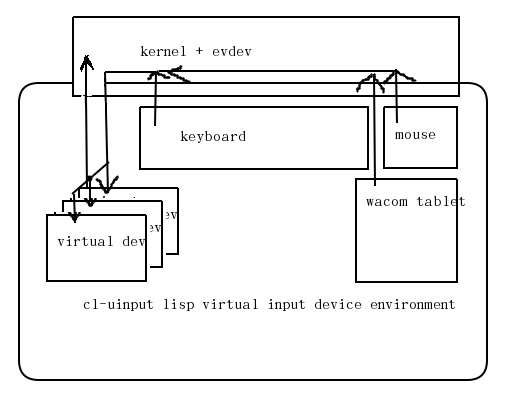

# Common Lisp Virtual Input Devices for Linux with /dev/uinput and evdev


* userspace virtual input devices
* pipe created at /tmp/cl-uinput-pipe for /dev/uinput access
* multiplex, filter, and process input devices with Common Lisp

# Dependencies
* apt-get install libfixposix-dev
* http://github.com/jtgans/cl-evdev
* http://github.com/jtgans/cl-event-handler
* https://github.com/cffi-posix/fd-gray
* https://github.com/sionescu/iolib
* run (load-dependencies) in cl-uinput.lisp
* (load "cl-uinput.asd") (ql:quickload :cl-uinput)
* see C dependencies in uinput_listener.c

# Install
* (load "cl-uinput.asd")
* (ql:quickload :cl-uinput)
* gcc uinput_listener.c -o uinput_listener
* uinput documentation: https://www.kernel.org/doc/html/v4.12/input/uinput.html
* see github.com/jtgans/cl-evdev for linux input device events
* see https://who-t.blogspot.com/2016/05/the-difference-between-uinput-and-evdev.html for an introduction to uinput virtual devices

# API
```common lisp
(start-uint-pipe-listener)
(close-uint-pipe-listener)
(send-virtual "boo!")
(start-evdev-listener "/dev/input/event4")
(usleep 1500)
;; enter keyboard input
(close-evdev-listener)
```

# Todo
* start/stop virtual-devices uinput_listener
* start/stop evdev input device -> virtual-device
* register evdev binds (evdev -> uninput_listener keys (Esc -> Ret))
* sbcl evdev keys global REPL then
* record -> uinput pipe
* register /dev/input/event4 virtual device events (send-key)
* key macro uint_listener, from record (hotkey begin)
* define and send macros from keyboard -> SBCL -> uinput virtual device
* tests
